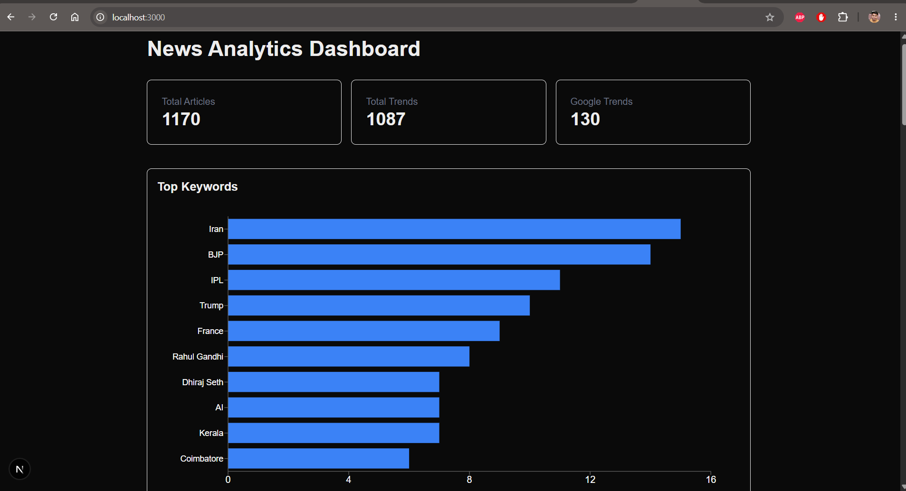

# Real-Time News & Trends Analytics Platform

An end-to-end Data Engineering project that automatically collects news articles and trending topics, processes them using Natural Language Processing (NLP), stores analytics data in Supabase, and visualizes insights through an interactive Next.js dashboard.

---

## Project Overview

This platform continuously ingests news data from multiple RSS feeds and Google Trends, extracts meaningful entities such as people, organizations, events, and products using spaCy, and stores the results in PostgreSQL (Supabase).

The processed data is then displayed through a modern analytics dashboard built with Next.js and Recharts.

---

## Features

### News Ingestion

- The Hindu RSS Feed
- Hindustan Times RSS Feed
- Indian Express RSS Feed
- NDTV RSS Feed

### Trend Detection

- Google Trends RSS
- Automatic keyword extraction
- Entity recognition using NLP

### Data Pipeline

- Automated ETL workflow
- Duplicate detection
- Hourly ingestion using GitHub Actions
- Cloud-hosted PostgreSQL database

### Dashboard

- Total Articles
- Total Trends
- Top Keywords
- Trend Analytics
- Real-time updates

---

## Architecture

```text
RSS Feeds
     │
     ▼
Python ETL Pipeline
     │
     ▼
spaCy NLP Processing
     │
     ▼
Supabase (PostgreSQL)
     │
     ▼
Next.js Dashboard
     │
     ▼
Analytics & Visualizations
```

---

## Tech Stack

### Data Engineering

- Python
- Feedparser
- spaCy
- PostgreSQL
- Supabase

### Automation

- GitHub Actions

### Frontend

- Next.js
- TypeScript
- Tailwind CSS
- Recharts

---

## Database Schema

### articles

| Column | Type |
|----------|----------|
| id | bigint |
| title | text |
| link | text |
| summary | text |
| source | text |
| image_url | text |
| published_at | timestamp |

### trends

| Column | Type |
|----------|----------|
| id | bigint |
| keyword | text |
| entity_type | text |
| source | text |
| article_link | text |
| trend_date | date |
| created_at | timestamp |

### google_trends

| Column | Type |
|----------|----------|
| id | bigint |
| keyword | text |
| traffic | text |
| news_title | text |
| news_url | text |
| created_at | timestamp |

---

## Screenshots

### Dashboard



---

## Local Setup

### Clone Repository

```bash
git clone https://github.com/HarshICE/news-trends-analytics.git

cd news-trends-analytics
```

### Install Python Dependencies

```bash
pip install -r requirements.txt
```

### Environment Variables

Create `.env`

```env
SUPABASE_URL=YOUR_SUPABASE_URL
SUPABASE_KEY=YOUR_SUPABASE_KEY
```

### Run ETL Pipeline

```bash
python fetch_rss.py

python fetch_google_trends.py
```

### Run Dashboard

```bash
cd news-dashboard

npm install

npm run dev
```

Open:

```text
http://localhost:3000
```

---

## Automation

The ETL pipeline runs automatically using GitHub Actions.

Schedule:

```text
Every Hour
```

Workflow:

```text
RSS Feeds
      ↓
Python ETL
      ↓
Entity Extraction
      ↓
Supabase
      ↓
Dashboard Update
```

---

## Future Enhancements

- Sentiment Analysis
- Top People Dashboard
- Top Organizations Dashboard
- Trend Forecasting
- Historical Trend Analysis
- Real-time Alerts
- API Layer

---

## Author

Harsh Icecreamwala

GitHub:
https://github.com/HarshICE